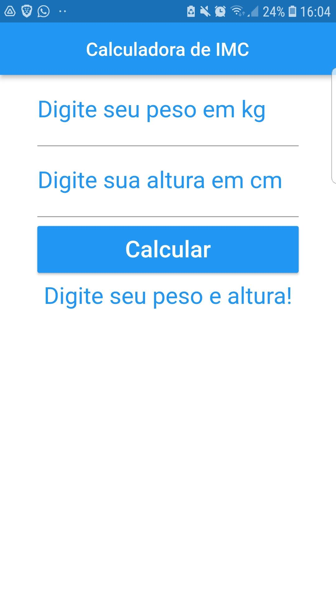
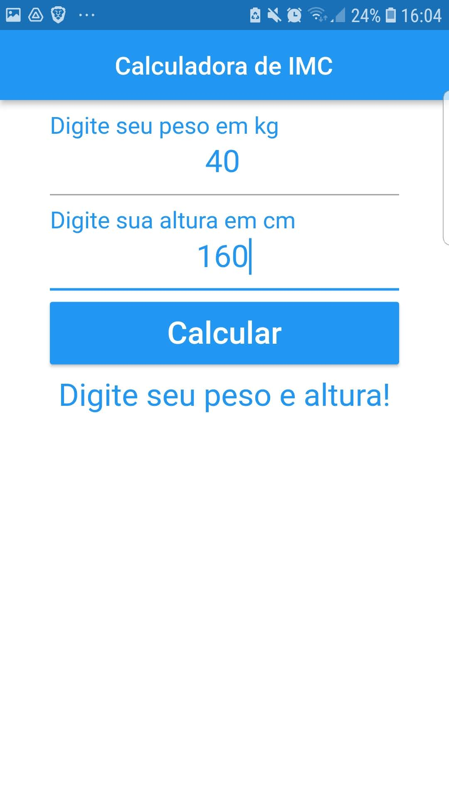
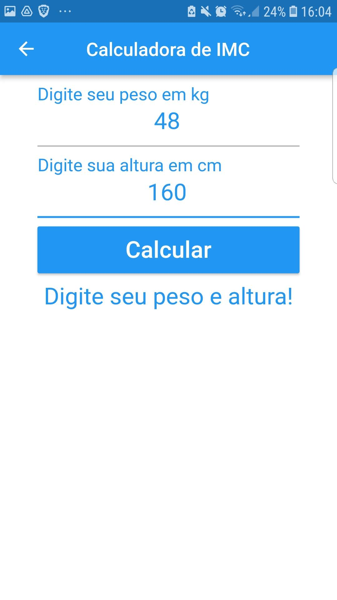

# Calculadora imc

Calculadora de IMC para atividade

## Descrição

Após informar o peso e altura, o aplicativo informa seu indice, o tipo e tem uma cor para simbolizar os riscos do tipo.

</img>

</img>

</img>

</img>

</img>
